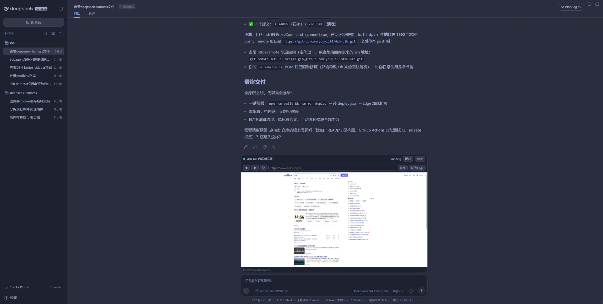

# dsh-bib

**在 DSH（DeepSeek Harness）对话内嵌入可控的真实浏览器视口 —— 人和 AI 代理共享同一个浏览器标签页。**

通过 Edge 扩展（`chrome.debugger`）+ 本地中继桥，让 AI 代理和人类共同操作同一个真实浏览器标签页：AX 树感知、坐标/ref 点击、实时画面预览、**单标签锁定**（AI 操作不打断你的浏览）。复用你的真实 Edge 登录态，无需 headless、无需重新登录。



> 详细规格见 [`docs/spec.md`](docs/spec.md)（v1 定稿 · 已实现）。

---

## 为什么需要它

- **AI 代理操作真实浏览器**：不是截图猜测，而是通过 CDP 拿到页面的语义 AX 树（带坐标与稳定 ref），像人一样点击、输入、滚动。
- **复用真实登录态**：直接 attach 你日常使用的 Edge 标签页，登录过的站点（小红书、Google、企业后台等）开箱即用。
- **人和 AI 共享视口**：DSH 对话里嵌一个浏览器窗口，模型操作时画面实时跟进；你也可以随时切到真实 Edge 手动操作，互不干扰。
- **单标签锁定**：AI 永远在同一个标签页操作，点击链接弹出的新标签会被自动关闭，你的浏览器焦点永远不会被 AI 操作抢走。

## 特性

| 能力 | 说明 |
|---|---|
| `browser_*` 工具集 | status / open / navigate / go / reload / click / type / scroll / screenshot / eval / tabs / switch / activate / stop |
| AX 树感知 | 每次操作后返回页面语义树（role + 名称 + 视口坐标 + `ref_N` 稳定引用），可点击的卡片/链接自动收录 |
| ref 点击 | 树节点带 ref，点击时自动滚动到元素并点中心，无需手动算坐标 |
| 实时画面 | 操作后主动截帧 + 2s 周期刷新，页面自身变化（懒加载/动画）也能跟上 |
| 单标签锁定 | target=_blank 新标签自动关闭；AI 操作（导航/点击/输入/滚动）全部后台进行，浏览器焦点不被抢 |
| 自动发现 | 扩展经 DSH Web 路由 `/dsh-bib/bridge-info` 自动发现桥的端口与令牌，免手动配对 |
| 保活机制 | 页面心跳动画 + chrome.alarms，规避 MV3 Service Worker 30s 空闲限制 |

## 架构

```
┌─────────────┐     HTTP + X-Bib-Token     ┌──────────────┐    stdin/stdout    ┌──────────────┐
│  Edge 扩展  │ ─────────────────────────▶ │  中继桥      │ ◀────────────────▶ │ DSH Host 插件 │
│ (debugger)  │ ◀───────────────────────── │ (bridge.js)  │    JSON 命令/事件  │ (host.js)     │
└─────────────┘     帧/命令结果/事件       └──────────────┘                   └──────┬───────┘
      │                                                              browser_* 工具 + bib/* RPC
      │ chrome.debugger attach 真实标签                                 │
      ▼                                                                 ▼
┌─────────────┐                                          ┌──────────────────────────┐
│ 真实浏览器   │                                          │ DSH Web GUI              │
│ (你的登录态) │                                          │ 对话内嵌浏览器窗口        │
└─────────────┘                                          │ (conversation.input.dock)│
                                                         └──────────────────────────┘
```

- **扩展**（`extension/`）：MV3 service worker，`chrome.debugger` attach 真实标签页，转发 CDP 帧/事件到桥，从中继桥取命令执行。
- **中继桥**（`bridge/bridge.js`）：零依赖 Node http 服务，命令队列（FIFO）、长轮询、鉴权（X-Bib-Token + Origin 校验）、CORS。
- **DSH 插件**（`plugin/host.js` + `plugin/client.jsx`）：Host 半区提供 14 个 `browser_*` 工具 + `bib/*` RPC + 自动发现路由；Client 半区把浏览器窗口注入 `conversation.input.dock`。

## 安装

### 1. 加载 Edge 扩展

1. 打开 `edge://extensions`
2. 打开「开发人员模式」
3. 点击「加载解压缩的扩展」，选择本仓库的 `extension/` 目录

### 2. 部署 DSH 插件

一条命令生成部署描述文件（内联桥源码 + host/client 代码）：

```bash
npm run build    # 生成 plugin/host.js（内联桥代码）
npm run deploy   # 生成 deploy.json（host + client 完整代码 + 安装说明）
```

然后在 DSH 对话中对 AI 说：**「读取 deploy.json 并部署 dsh-bib」**——AI 会用 `cordis_define` 提交代码并激活。桥代码已内联，**无需任何绝对路径配置，clone 即用**。

> 若 DSH Web 端口不是 3080，修改 `extension/background.js` 顶部的 `DSH_ORIGIN`（唯一需要改的位置）。

### 3. 启动

在对话中让模型调用 `browser_open <url>`，扩展会自动发现桥并 attach 标签页。首次可能需要：打开扩展 popup 点一次「连接」完成 attach（部分 Edge 版本要求用户手势）。

## 使用

模型通过 `browser_*` 工具操作浏览器：

```
browser_open("https://www.xiaohongshu.com")   # 打开页面（当前标签内导航）
browser_tabs()                                 # 列出标签
browser_click(ref="ref_42")                    # 按树节点 ref 点击（自动滚动+点中心）
browser_type(text="关键词\n")                   # 输入文本（支持中文；末尾 \n 回车）
browser_scroll(dy=400)                         # 滚动
browser_screenshot()                           # 取当前帧
browser_eval(expression="...")                 # 执行 JS 取回结果
```

人类可以在 Edge 里直接操作同一个标签页；DSH 对话内的浏览器窗口会实时跟随（≤2s）。

## 测试

中继桥有冒烟测试（19/19 通过）：

```bash
cd bridge
node bridge.test.mjs
```

## 目录结构

```
dsh-bib/
├── bridge/            # 中继桥（bridge.js + 冒烟测试）
├── docs/
│   ├── spec.md        # v1 定稿规格
│   └── archive/       # 历史设计文档
├── extension/         # Edge MV3 扩展（background + popup）
├── plugin/            # DSH 动态插件（host.template.js + 构建生成的 host.js + client.jsx）
└── scripts/           # 构建脚本（build-host.mjs：内联桥源码生成 host.js）
```

## 已知限制

- **`browser_type` 输入**：采用 DOM 方式注入（不打断浏览器焦点）；对极少数依赖真实键盘事件序列的富文本编辑器可能不完整，会回退到 CDP（此时会短暂激活标签页）。
- **自定义 JS 下拉组件**：原生 `<select>` 可后台直接设值；依赖 UI 点击的自定义下拉可能需要前台。
- **桥令牌**：PoC 使用 `Math.random` 生成（Host 沙箱无 CSPRNG builtin），正式部署建议自行加固。
- **多标签**：单标签锁定模型下，从当前标签弹出的新标签会被自动关闭；若需多标签，模型可显式 `browser_switch` / `browser_open`（会激活目标标签）。

## License

[MIT](LICENSE)
